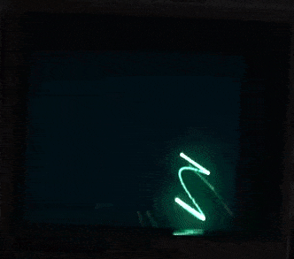
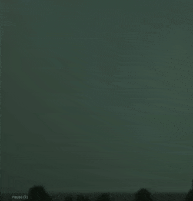
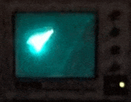
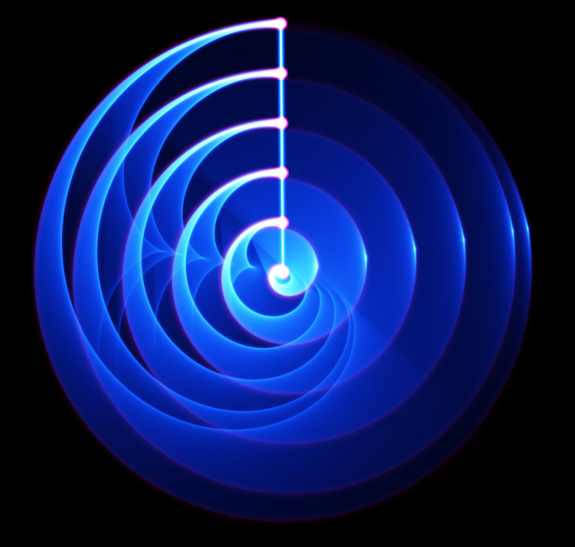
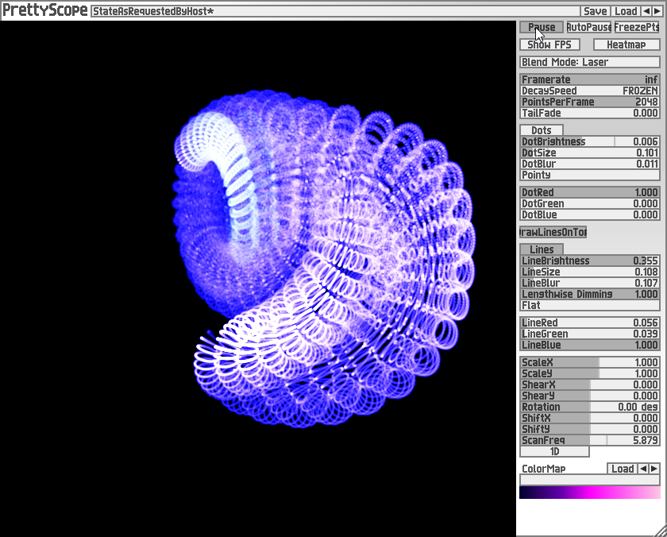
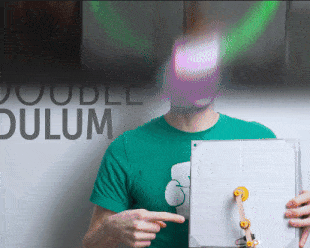
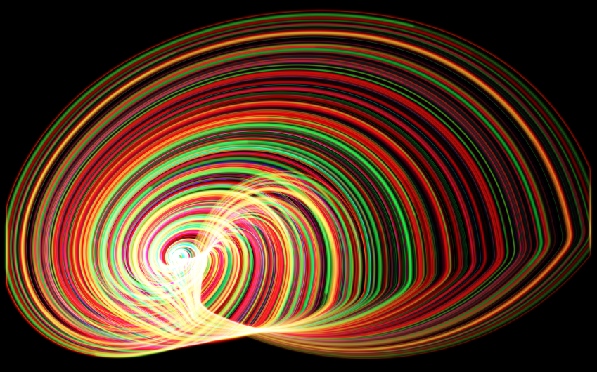
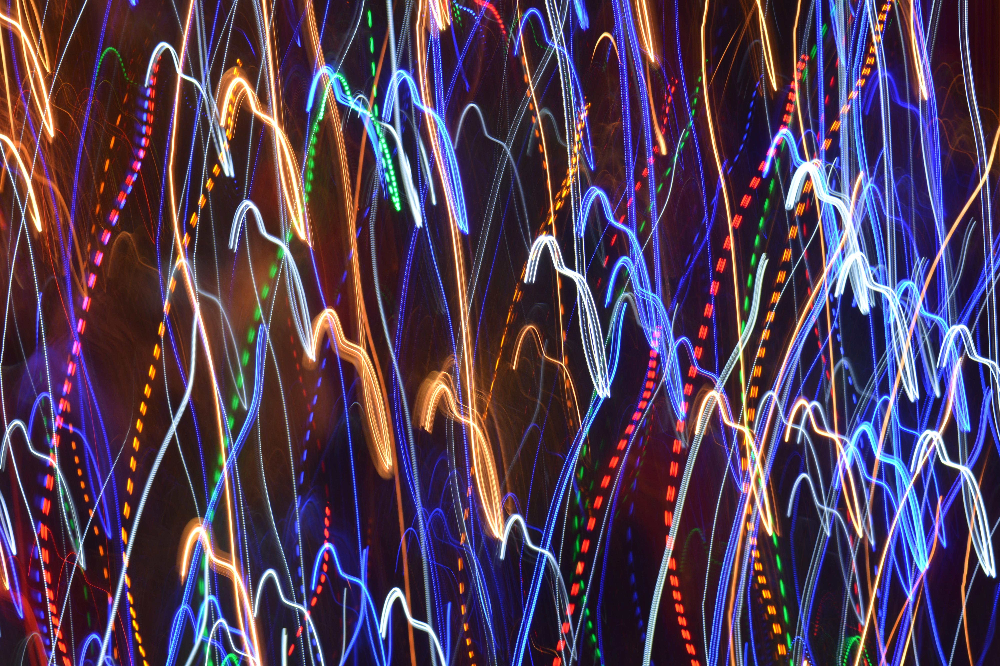

# 🟢 Phosphor — an oscilloscope glow field guide

> *A phosphor screen doesn't draw a line. It remembers where the beam has*
> *been, and forgets a little slower each moment you're not looking.*

This is a fork of [`soemdsp-sandbox`](https://github.com/soundemote/soemdsp-sandbox)
that gives its **phosphor-style scope renderers** (`lineBurnOscilloscope`,
`scope2d`/`scope2dTrace`, `dotOscilloscope`, `valueOscilloscope`) real
CRT-phosphor grounding: what a phosphor screen physically is, why analog
scopes glow the way they do, how that maps onto this sandbox's `decay`
settings, and where the visual language comes from.

## 🖼️ Reference material

Reference gallery of phosphor-oscilloscope photography and captures — CRT
persistence trails, Lissajous burn patterns, vectorscope glow, the whole
"green line that refuses to fully die" aesthetic this fork is chasing:

- 🎞️ **[imgur.com/gallery/design-guide-phosphor-oscilloscope-4kmlxXR](https://imgur.com/gallery/design-guide-phosphor-oscilloscope-4kmlxXR)** — primary reference gallery
- 🎞️ **[imgur.com/gallery/kM2ThAa](https://imgur.com/gallery/kM2ThAa)** — supplementary "visual inspiration" gallery
- 🎞️ **[imgur.com/gallery/RwoYt](https://imgur.com/gallery/RwoYt)** — bokeh/point-glow reference

A representative set was hand-transferred from the gallery and is embedded
directly throughout this doc (see [`media/`](media/)), alongside the links
above to the full galleries.

Individual video references gathered alongside the images:

- 🎥 [Circular oscilloscope example](https://youtu.be/wDkG1CgREaQ)
- 🎥 [Colorful image burn example](https://youtu.be/qeMWUlUBFbs)
- 🎥 [Bloom example](https://youtu.be/mndaenaVClc)
- 🎥 [Visual inspiration](https://youtu.be/7kI1d7DMbco)
- 🎥 [Slow motion aesthetic](https://youtu.be/XOAsmd-FFb0)
- 🎥 [Image burn example (concentric rainbow rings)](https://youtu.be/KaEy23DKG_A)

---

## 📖 Table of contents

- [🖼️ Reference material](#️-reference-material)
- [🕯️ What is a phosphor screen?](#️-what-is-a-phosphor-screen)
- [🧪 The physics in one paragraph](#-the-physics-in-one-paragraph)
- [📐 Anatomy of the glow](#-anatomy-of-the-glow)
- [⏱️ Fluorescence vs. phosphorescence: why the line lingers](#️-fluorescence-vs-phosphorescence-why-the-line-lingers)
- [🎛️ How this maps to the sandbox's scope renderers](#️-how-this-maps-to-the-sandboxs-scope-renderers)
- [🧮 The DSP/render model](#-the-dsprender-model)
- [🏺 Prior art: PrettyScope](#-prior-art-prettyscope)
- [🌀 Chaos + phosphor: a natural pairing](#-chaos--phosphor-a-natural-pairing)
- [📊 Common phosphor types (P-series)](#-common-phosphor-types-p-series)
- [📚 References & primary sources](#-references--primary-sources)
- [⚖️ A note on naming & IP](#️-a-note-on-naming--ip)

---

## 🕯️ What is a phosphor screen?

A CRT (cathode-ray tube) oscilloscope screen is coated in **phosphor** — a
crystalline compound that **absorbs energy from an electron beam and
re-emits it as visible light over time**, rather than instantaneously. The
beam sweeps across the screen tracing the signal; the phosphor is what turns
that invisible, momentary electron path into something you can actually
*see* — and, crucially, into something you can still see for a while
*after* the beam has already moved on. 🔦

That lingering is not a flaw being tolerated. It's the entire reason analog
scopes look the way they do: fast-moving parts of a waveform look dim and
thin (the beam barely touched that spot before moving on), slow-moving or
frequently-revisited parts look bright and thick (the phosphor keeps getting
re-excited before it can fully decay). The brightness of every point on the
screen is a *record of dwell time*, not just position.

A real captured example of this: a chaotic, looping green trace on an actual
CRT scope (tangled, multiple overlapping revolutions, graticule grid visible
behind the glow) shows exactly this — segments the beam revisited often
read brighter and thicker than segments it only passed through once.



## 🧪 The physics in one paragraph

Phosphor decay after excitation typically follows something close to an
**exponential falloff**, though real phosphors often show a fast initial
drop followed by a longer "afterglow" tail (a sum of multiple exponential
components, not a single clean one):

```
I(t) = I₀ · e^(−t / τ)
```

where `I₀` is the initial emitted intensity right after the beam passes,
`t` is elapsed time, and `τ` (tau) is the **decay time constant** — how
long it takes brightness to fall to about 37% (1/e) of its initial value.
Different phosphor compounds are engineered for wildly different `τ`,
anywhere from microseconds (fast phosphors for high-refresh digital
readouts) to multiple seconds (long-persistence phosphors built specifically
so a human eye can study a single fast transient event without it vanishing
before you can look at it).

## 📐 Anatomy of the glow

- **Beam** — the electron stream, positioned by deflection plates to trace
  the signal in real time. It's either on (unblanked) or off (blanked)
  moment to moment.
- **Phosphor coating** — the actual light-emitting layer. Its chemistry
  determines color, brightness-per-electron, and decay time.
- **Persistence** — the umbrella term for "how long the trace stays
  visible" — a mix of the phosphor's own decay time *and* how the human
  visual system integrates brief flashes into an apparently-continuous
  glow.
- **Bloom** — bright/fast-moving trace segments visually "spreading" beyond
  their true width, both a real optical effect (light scattering in the
  glass/coating) and a perceptual one (bright things look bigger to the
  eye than they measure).

Two reference captures make the bloom point concretely: a dim, paused scope
trace shows almost no bloom — just a clean, barely-visible line — while a
saturated, overexposed triangular blob on a small CRT shows the light
visibly bleeding into the surrounding dark bezel. Bloom isn't a fixed
visual property of "a glowing thing" — it only shows up once brightness
crosses a threshold, which is exactly the kind of nonlinear,
brightness-dependent behavior a flat `decay * brightness` model can't
reproduce (see [Prior art](#-prior-art-prettyscope) below for a model that
can).

 

## ⏱️ Fluorescence vs. phosphorescence: why the line lingers

Two related-but-distinct light-emission mechanisms get lumped together
under "glow-in-the-dark," and CRT phosphors actually rely on a mix of both:

- **Fluorescence** — near-instant re-emission (nanoseconds), stops the
  moment excitation stops. This is what makes the *core* trace sharp and
  bright exactly where the beam currently is.
- **Phosphorescence** — emission continues well after excitation stops
  (milliseconds to seconds+), because the absorbed energy gets trapped in
  metastable electron states before it can radiate. This is the *tail* —
  the part that makes a fast one-shot transient still readable a moment
  after it happened.

A "phosphor look" in a rendered oscilloscope display is really asking for
both effects at once: an instantaneously bright leading edge, and a slower
fading tail behind it.

## 🎛️ How this maps to the sandbox's scope renderers

This sandbox already models this — the scope rendering pipeline
(`node-graph-module-scopes.js`) carries a literal `phosphorFrame` state
object per burn-style scope, and every burn/trace renderer
(`lineBurnOscilloscope`, `scope2d`/`scope2dTrace`, `dotOscilloscope`) has a
`decay` setting (default `0.12`) controlling exactly the `τ` behavior
described above: how much of each frame's brightness survives into the
next, i.e. how "long-persistence" vs. "fast/digital" the trace looks.

- `decay → 0` — no afterglow at all, every frame is drawn fresh. This is
  the "digital storage scope, refresh-rate-limited" look, not a phosphor
  look.
- `decay → 1` — the trace essentially never fades, building up a permanent
  burn-in image over time (useful deliberately for things like Lissajous
  figures or long-exposure-style captures, closer to a genuinely
  long-persistence P7-style phosphor).
- Somewhere in between (the `0.12` default) — the everyday "green scope
  glow" look: fast enough that the display stays legible and current, slow
  enough that motion leaves a visible trail.

A real long-exposure capture of a radar-style sweep (concentric arcs
radiating from a bright center, each pass fainter and wider than the last)
is a clean visual example of `decay` pushed high on a polar/angular sweep
rather than a Cartesian XY trace — worth keeping in mind as a rendering
mode distinct from the burn/trace modes already listed.



## 🧮 The DSP/render model

A minimal per-pixel phosphor model, matching what a `decay`-driven burn
buffer is actually doing each frame:

```
brightness[pixel] = brightness[pixel] * decay + newHit[pixel] * intensity
```

Run every frame, this is a **one-pole IIR lowpass applied to brightness in
the time domain** — the exact same math as an audio one-pole smoothing
filter, just operating on light instead of sound. `decay` closer to 1 =
lower cutoff frequency = slower to respond = longer visual "tail." It's the
same primitive already used all over this sandbox's audio DSP
(`onePoleLowpassSample`, envelope followers, etc.) — phosphor persistence
and an envelope follower's release stage are, mathematically, the same
operation pointed at different data.

That flat model is the *minimum viable* version — it treats every pixel's
decay identically regardless of how bright it is. Real phosphor (and the
bloom/afterglow references above) behaves nonlinearly: brighter spots drain
faster, dim lingering spots get a relative boost, and the fade eventually
reaches true black instead of asymptoting forever. See below for an
already-built, in-house model that does exactly this.

## 🏺 Prior art: PrettyScope

[`prettyscope-revival`](https://github.com/soundemote/prettyscope-revival)
and [`prettyscope-clap`](https://github.com/soundemote/prettyscope-clap) are
soundemote's own prior work on a real OpenGL oscilloscope/signal
visualizer — same org, MIT licensed, genuinely reusable, not outside IP.
`prettyscope-revival`'s `src/visual/` already implements a working, tested
"Phosphor" decay mode (as opposed to a simpler "Classic" flat-decay mode)
with meaningfully more nuance than the flat model above:

- **Separate trace and glow colors** — a sharp, bright "core" color plus a
  distinct, softer "halo" color, rather than one flat hue. This is a direct
  implementation of the fluorescence-vs-phosphorescence split described
  above: the core is the fluorescent flash, the halo is the phosphorescent
  tail, and they're allowed to be genuinely different colors — which lines
  up with the real P7 color-shift-during-decay behavior described in the
  P-series section below.
- **Brightness-dependent decay** — brighter pixels lose intensity faster
  than dim ones each frame, rather than every pixel decaying by the same
  fraction. This matches how phosphor recombination actually behaves (more
  excited states available to decay from at higher brightness) and is
  exactly the mechanism that produces a bloom threshold instead of a
  uniform glow.
- **An afterglow boost specifically for dim, lingering pixels** — a
  separate term that keeps faint trailing pixels alive longer than the
  brightness-dependent drain alone would allow, which is what actually
  produces a long, soft tail behind a fast-moving trace rather than a flat
  fade.
- **A hard floor plus gamma shaping** on the way to black — guarantees the
  image actually reaches true black in finite time (a pure exponential
  never quite gets there) and shapes the character of that final approach.
- **Gaussian/error-function soft edges on line segments** (rather than hard
  antialiased lines) — this is the mechanism behind the "DotBlur"/"LineBlur"
  softness visible in PrettyScope's own UI, and it's what makes a bright
  trace visually bloom outward instead of just being a wider hard stroke.



If/when this sandbox's own phosphor renderers get upgraded past a flat
`decay` value, `prettyscope-revival`'s shader source is the concrete
reference implementation to study — not a from-scratch redesign. (Also
worth a look, tangentially: the fork's own
[`jerobeam-modules` branch](https://github.com/elanhickler/soemdsp-sandbox-phosphor/tree/jerobeam-modules)
has active work touching the Jerobeam Spiral/Radar family, which a real
long-exposure radar-sweep reference above connects to directly.)

## 🌀 Chaos + phosphor: a natural pairing

Two reference captures point at a specific, concrete rendering upgrade:
a physical double-pendulum demo (the classic "sensitive to initial
conditions" chaos-theory apparatus) shown alongside its own light-trail
path, and a striking concentric rainbow ring-burn image explicitly
generated by *a chaos sound generator driving the display while its line
color was adjusted live*.

That second one matters directly here: this sandbox already has a full
Chaos category (Lorenz/Hénon/Chua attractors, the Logistic Map), and
already has XY burn-style scope renderers (`scope2d`/`scope2dTrace`). What
it doesn't have yet is color that evolves with time/iteration rather than
staying a fixed hue — which is the one ingredient that turns "a chaotic
attractor traced on a burn scope" into "a concentric rainbow ring shell."
That's a concrete, validated rendering target, not a speculative one — the
reference image proves it works and looks genuinely striking.

 

## 📊 Common phosphor types (P-series)

Historic scope/CRT phosphors are cataloged by a **P-number**, each tuned
for a different application:

| P-type | Color | Persistence | Typical use |
|--------|-------|-------------|-------------|
| P1 | Green | Medium | General-purpose scopes (the classic "scope green") |
| P4 | White | Medium-short | TV/monitor CRTs |
| P7 | Blue-white → yellow-green afterglow | Long (seconds) | Radar displays, long-persistence storage scopes |
| P11 | Blue | Short | Photographic scope traces (fast film needs a fast, bright flash, not lingering glow) |
| P31 | Green | Short-medium | High-brightness general purpose, later replaced P1 in many designs |

P7 is the one worth calling out specifically for a "beautiful phosphor
glow" aesthetic — it's actually a *two-layer* phosphor (a fast blue-white
layer on top of a slow yellow-green layer beneath), so a single bright
event visibly **changes color as it decays**: bright blue-white at impact,
fading through to a lingering green afterglow. A reference capture of a
very-low-frequency signal traced as a spiral shows exactly this in
practice: the outer (newest) rings read bright magenta, the middle rings
cool to white, and the innermost (oldest) rings fade to gray — a direct,
photographed example of color-shift-during-decay, and independent visual
confirmation of the same effect PrettyScope's trace/glow color split is
built to reproduce.




## 📚 References & primary sources

- Tektronix — [Oscilloscope Basics: Reading & Operating Tutorial](https://www.tek.com/en/documents/primer/oscilloscope-basics)
- Tektronix — [Oscilloscope Types](https://www.tek.com/en/documents/primer/oscilloscope-types)
- Tektronix — [Digital Phosphor Oscilloscopes](https://www.tek.com/en/datasheet/digital-phosphor-oscilloscopes)
- Tektronix — [Digital Phosphor Oscilloscope (TDS784D datasheet)](https://www.tek.com/en/datasheet/tds784d)
- Test & Measurement Tips — [Digital phosphor oscilloscopes, persistence, and eye patterns](https://www.testandmeasurementtips.com/digital-phosphor-oscilloscope-persistence-and-eye-patterns-faq/)
- Electronic Design — [Super Phosphor Oscilloscope](https://www.electronicdesign.com/technologies/power/power-supply/power-electronics-systems/article/21197100/super-phosphor-oscilloscope)
- soundemote — [`prettyscope-revival`](https://github.com/soundemote/prettyscope-revival) (in-house prior art, phosphor shader)
- soundemote — [`prettyscope-clap`](https://github.com/soundemote/prettyscope-clap) (in-house prior art, CLAP plugin shell)

## ⚖️ A note on naming & IP

"Phosphor," "P1–P31," and related terminology describe well-documented,
decades-old, industry-standard CRT display technology and are not
proprietary to any single manufacturer. Brand names referenced above
(Tektronix, etc.) are used purely descriptively, to credit primary-source
technical documentation — this fork is **not affiliated with, endorsed by,
or sponsored by** any of the manufacturers or publications linked here.

Reference photography/video gathered during research (oscilloscope
captures, long-exposure light trails, bokeh photography, a PrettyScope
screenshot) is committed in [`media/`](media/) and embedded throughout this
document for visual grounding. The PrettyScope screenshot is soundemote's
own software (same org as this repo) and is not third-party. The remaining
images/GIFs originate from the linked imgur reference galleries above;
they're included here for research/documentation purposes specific to this
fork, with full attribution and links back to the source galleries.
